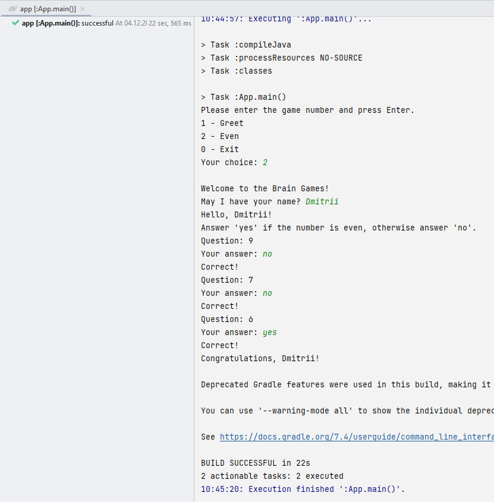
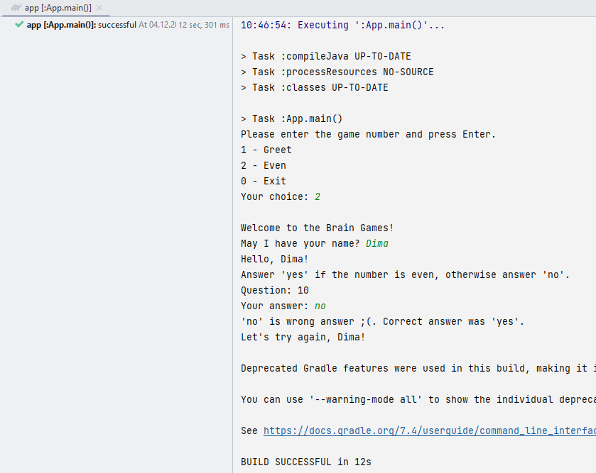
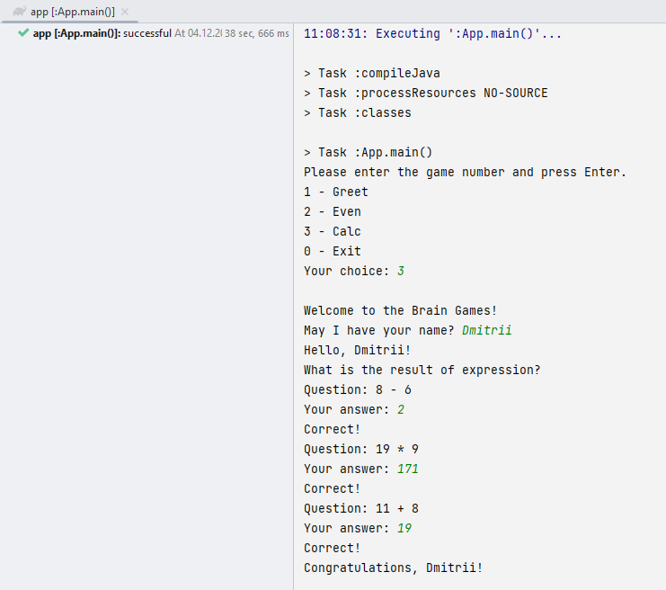
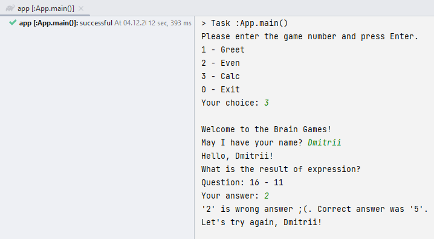
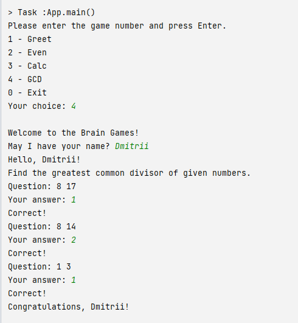
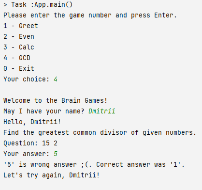
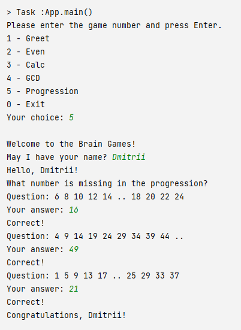
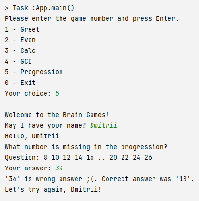
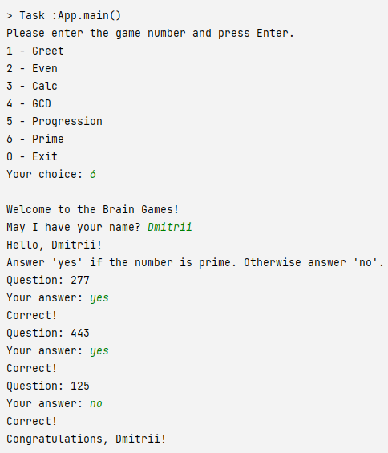
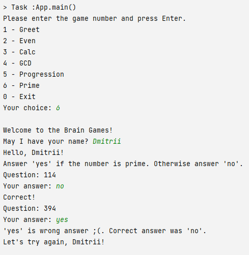

### Hexlet tests and linter status:

### Even

Победа

Поражение

### Calc

Победа

Поражение

### GCD

Победа

Поражение

### Progression

Победа

Поражение

### Prime

Победа

Поражение

